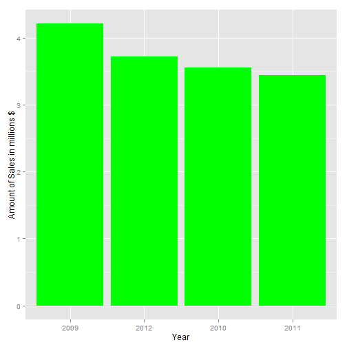
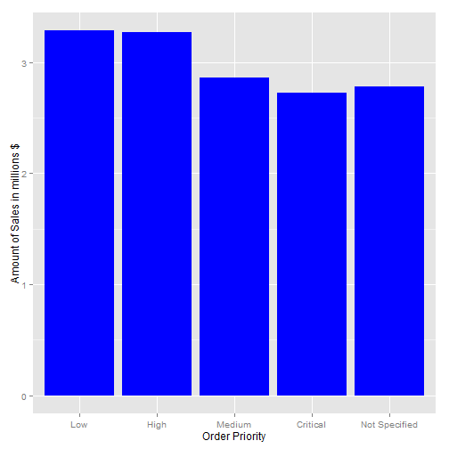

## Overview

- This sales recort includes the data collected over the period from 2009 to 2012 years
- The brief source data could be seen below:


```
##    Order.ID Order.Date Order.Priority Order.Quantity    Sales
## 1         3 2010-10-13            Low              6   261.54
## 2       293 2012-10-01           High             49 10123.02
## 3       293 2012-10-01           High             27   244.57
## 4       483 2011-07-10           High             30  4965.76
## 5       515 2010-08-28  Not Specified             19   394.27
## 6       515 2010-08-28  Not Specified             21   146.69
## 7       613 2011-06-17           High             12    93.54
## 8       613 2011-06-17           High             22   905.08
## 9       643 2011-03-24           High             21  2781.82
## 10      678 2010-02-26            Low             44   228.41
```

---

## Main calculated characteristics

- The most big order is 

```
##      Order.ID Order.Date Order.Priority Order.Quantity Sales
## 4675    29766 2009-03-21         Medium             13 89061
```

- The minimal order order is 

```
##      Order.ID Order.Date Order.Priority Order.Quantity Sales
## 1067     6374 2011-08-07       Critical              1  2.24
```
- The total turnover over the peiod is 14.92 millions $

---

## The distribution by year

 

---

## Distribution of turnover depending on oreder priority

 
